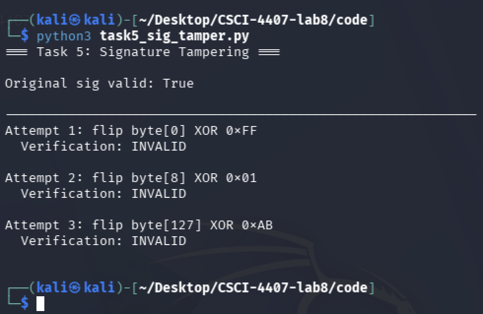
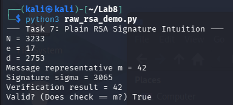
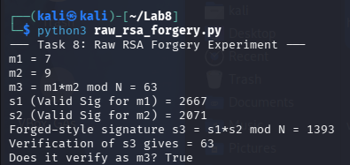
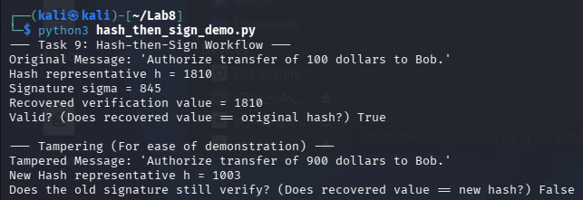
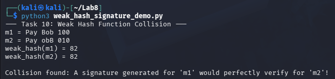

# Department of Computer Science & Engineering
## CSCI/CSCY 4407: Security & Cryptography
## Lab 8 Report: Digital Signatures – RSA, Forgery & Hash-then-Sign

**Group Number:** Group 10
**Semester:** Spring 2026
**Instructor:** Dr. Victor Kebande
**Teaching Assistant:** Celest Kester
**Submission Date:** APR 17 2026

**Group Members:**
- Matthew Kenner
- Jonathan Le
- Cassius Kemp

---

## Table of Contents

1. [Introduction](#introduction)
2. [Environment](#environment)
3. [Files Included](#files-included)
4. [Task 1 – Setup and Messages](#task-1)
5. [Task 2 – RSA Key Generation](#task-2)
6. [Task 3 – Signing and Verification](#task-3)
7. [Task 4 – Message Tampering](#task-4)
8. [Task 5 – Signature Tampering](#task-5)
9. [Task 6 – Public Key Trust](#task-6)
10. [Task 7 – Plain RSA (Python)](#task-7)
11. [Task 8 – RSA Forgery](#task-8)
12. [Task 9 – Hash-then-Sign](#task-9)
13. [Task 10 – Weak Hash Collision](#task-10)
14. [Task 11 – Comparison and Reflection](#task-11)
15. [Appendix – Python Scripts](#appendix)
16. [Pre-Submission Checklist](#checklist)

---

## Introduction <a name="introduction"></a>

This report documents the implementation and analysis performed for the Digital Signatures lab. Tasks cover RSA key generation, signing and verification, message and signature tampering, public key trust models, plain RSA weaknesses, existential forgery, the hash-then-sign paradigm, and weak hash collisions. Each task was completed in a Linux environment using Python 3 and the `cryptography` library. The report includes commands, source code, terminal outputs, screenshots, and interpretations for each experiment.

---

## Environment <a name="environment"></a>

All experiments were performed in a Linux environment using Kali Linux. Python 3 was used for all scripts, and RSA operations were implemented using Python's `cryptography` library.

- **Operating System:** Kali Linux
- **Python Version:** Python 3.12
- **Terminal:** Kali Linux terminal
- **Key Library:** `cryptography` (PyCA)
- **Installation:** Local Kali Linux install

---

## Files Included <a name="files-included"></a>

The following Python source files are included in this submission:

- `task1_setup.py` — Task 1: Directory setup and SHA-256 message hashes
- `task2_rsa_keygen.py` — Task 2: RSA key pair generation and export
- `task3_sign_verify.py` — Task 3: RSA-PSS signing and verification
- `task4_message_tamper.py` — Task 4: Detect tampered message via signature failure
- `task5_sig_tamper.py` — Task 5: Detect tampered signature
- `task6_pubkey_trust.py` — Task 6: Public key substitution / trust demonstration
- `task7_plain_rsa.py` — Task 7: Textbook (plain) RSA signature in Python
- `task8_rsa_forgery.py` — Task 8: Existential forgery against plain RSA
- `task9_hash_then_sign.py` — Task 9: Secure hash-then-sign construction
- `task10_weak_hash.py` — Task 10: Weak hash collision demonstration

---

## Task 1 – Setup and Messages <a name="task-1"></a>

### Objective

Create a working directory, populate it with message files, and compute SHA-256 hashes to establish a baseline for integrity verification throughout the lab.

### Steps Performed

- Created the lab directory and navigated into it
- Created three plaintext message files representing realistic signed documents
- Computed the SHA-256 hash of each message file
- Ran the setup script to confirm all files and hashes are correct

### Commands / Code Used

```bash
# [INSERT COMMANDS HERE — e.g., mkdir, cd, pwd, ls, sha256sum]
```

```python
# [CODE HERE — task1_setup.py]
```

### Output Evidence

> **[INSERT SCREENSHOT HERE — task1_directory_setup.png]**
> Show: terminal output of directory creation, `ls` listing all message files.

> **[INSERT SCREENSHOT HERE — task1_hashes.png]**
> Show: SHA-256 hash output for all three message files.

### Recorded Hash Values

| File | SHA-256 Hash |
|------|-------------|
| message1.txt | [INSERT HASH] |
| message2.txt | [INSERT HASH] |
| message3.txt | [INSERT HASH] |

### Explanation

**What was done:** [EXPLAIN HERE — describe the directory structure created and the files used.]

**What happened:** [EXPLAIN HERE — describe the hash output observed.]

**Why it matters:** [EXPLAIN HERE — explain why establishing a hash baseline matters before signing, and what the avalanche effect demonstrates.]

---

## Task 2 – RSA Key Generation <a name="task-2"></a>

### Objective

Generate an RSA key pair (public + private), export both keys to disk in PEM format, and inspect their structure to understand the components of an asymmetric key pair.

### Steps Performed

- Generated a 2048-bit RSA private key using the `cryptography` library
- Exported the private key to `private_key.pem` (PEM format, no encryption)
- Derived and exported the public key to `public_key.pem`
- Inspected both PEM files to confirm key structure

### Commands / Code Used

```bash
# [INSERT COMMANDS HERE — e.g., python3 task2_rsa_keygen.py, cat public_key.pem]
```

```python
# [CODE HERE — task2_rsa_keygen.py]
```

### Output Evidence

> **[INSERT SCREENSHOT HERE — task2_keygen_output.png]**
> Show: script execution output confirming key generation, key sizes, and file creation.

> **[INSERT SCREENSHOT HERE — task2_private_pem.png]**
> Show: contents of `private_key.pem` (first/last few lines — do NOT expose full private key).

> **[INSERT SCREENSHOT HERE — task2_public_pem.png]**
> Show: full contents of `public_key.pem`.

### Key Details

| Property | Value |
|----------|-------|
| Key type | RSA |
| Key size (bits) | [INSERT — e.g., 2048] |
| Public exponent (e) | [INSERT — e.g., 65537] |
| Private key file | private_key.pem |
| Public key file | public_key.pem |

### Explanation

**What was done:** [EXPLAIN HERE — describe the key generation process and parameters chosen.]

**What happened:** [EXPLAIN HERE — describe the PEM output and what each file contains.]

**Why it matters:** [EXPLAIN HERE — explain public/private key roles in digital signatures, why key size matters, and why the private key must be kept secret.]

---

## Task 3 – Signing and Verification <a name="task-3"></a>

### Objective

Sign a message using the RSA private key and verify the signature using the corresponding public key, demonstrating the core digital signature workflow.

### Steps Performed

- Loaded the private key from `private_key.pem`
- Signed `message1.txt` using RSA-PSS with SHA-256
- Saved the signature to `message1.sig`
- Loaded the public key and verified the signature against the original message
- Confirmed that verification returns success

### Commands / Code Used

```bash
# [INSERT COMMANDS HERE — e.g., python3 task3_sign_verify.py]
```

```python
# [CODE HERE — task3_sign_verify.py]
```

### Output Evidence

> **[INSERT SCREENSHOT HERE — task3_sign_output.png]**
> Show: script output displaying the signature (hex) and confirmation of signing.

> **[INSERT SCREENSHOT HERE — task3_verify_success.png]**
> Show: verification output confirming "Signature is VALID."

### Recorded Signature

| Item | Value |
|------|-------|
| Message file | message1.txt |
| Signature file | message1.sig |
| Signature (hex, first 32 bytes) | [INSERT] |
| Verification result | [INSERT — e.g., VALID] |

### Explanation

**What was done:** [EXPLAIN HERE — describe the signing and verification steps.]

**What happened:** [EXPLAIN HERE — describe the output and verification result.]

**Why it matters:** [EXPLAIN HERE — explain the asymmetric property: only the private key can sign, but anyone with the public key can verify. Discuss non-repudiation.]

---

## Task 4 – Message Tampering <a name="task-4"></a>

### Objective

Modify the signed message and attempt to verify the original signature, demonstrating that digital signatures detect unauthorized content changes.

### Steps Performed

- Used the valid signature from Task 3
- Modified `message1.txt` content (changed a word or value)
- Attempted to verify the original signature against the modified message
- Confirmed that verification fails with an `InvalidSignature` exception

### Commands / Code Used

```bash
# [INSERT COMMANDS HERE — e.g., nano message1.txt, python3 task4_message_tamper.py]
```

```python
# [CODE HERE — task4_message_tamper.py]
```

### Output Evidence

> **[INSERT SCREENSHOT HERE — task4_modified_message.png]**
> Show: the modified message content via `cat message1.txt`.

> **[INSERT SCREENSHOT HERE — task4_verify_fail.png]**
> Show: script output displaying "Signature is INVALID" or the caught `InvalidSignature` error.

### Tampering Results

| Attempt | Modification Made | Verification Result |
|---------|------------------|-------------------|
| 1 | [DESCRIBE CHANGE] | [INSERT — INVALID] |
| 2 | [DESCRIBE CHANGE] | [INSERT — INVALID] |
| 3 | [DESCRIBE CHANGE] | [INSERT — INVALID] |

### Explanation

**What was done:** [EXPLAIN HERE — describe what modifications were made to the message.]

**What happened:** [EXPLAIN HERE — describe the verification failure and the exception raised.]

**Why it matters:** [EXPLAIN HERE — explain how the signature binds to the exact message bytes and why any change invalidates it. Connect to integrity protection.]

---

## Task 5 – Signature Tampering <a name="task-5"></a>

### Objective

Modify the signature itself (leaving the message intact) and attempt verification, showing that a corrupted signature is also rejected.

### Steps Performed

- Used the valid message and original signature from Task 3
- Flipped one or more bytes in `message1.sig`
- Attempted to verify the tampered signature against the original (unmodified) message
- Confirmed that verification fails

### Commands / Code Used

```bash
python3 task5_sig_tamper.py
```

```python
BASE_DIR = os.path.join(os.path.dirname(__file__), "..")
MSG_PATH = os.path.join(BASE_DIR, "messages", "message1.txt")
SIG_PATH = os.path.join(BASE_DIR, "message1.sig")
PUB_PATH = os.path.join(BASE_DIR, "public_key.pem")

TAMPER_TARGETS = [
    (0,   0xFF),
    (8,   0x01),
    (127, 0xAB),
]


def tamper_signature(signature: bytes, byte_index: int, xor_mask: int) -> bytes:
    sig = bytearray(signature)
    sig[byte_index] ^= xor_mask
    return bytes(sig)


def main():
    public_key = load_public_key(PUB_PATH)

    with open(MSG_PATH, "rb") as f:
        message = f.read()

    with open(SIG_PATH, "rb") as f:
        original_sig = f.read()

    print("=== Task 5: Signature Tampering ===\n")
    print(f"Original sig valid: {verify_signature(public_key, message, original_sig)}\n")
    print("-" * 60)

    for i, (index, mask) in enumerate(TAMPER_TARGETS, start=1):
        tampered = tamper_signature(original_sig, index, mask)
        result   = verify_signature(public_key, message, tampered)
        print(f"Attempt {i}: flip byte[{index}] XOR 0x{mask:02X}")
        print(f"  Verification: {'VALID' if result else 'INVALID'}\n")```

### Output Evidence



### Tampering Results

| Byte Index Modified | XOR Mask | Verification Result |
|--------------------|----------|-------------------|
| [INSERT] | [INSERT] | [INSERT — INVALID] |
| [INSERT] | [INSERT] | [INSERT — INVALID] |
| [INSERT] | [INSERT] | [INSERT — INVALID] |

### Explanation

**What was done:** [EXPLAIN HERE — describe which bytes of the signature were flipped and how.]

**What happened:** [EXPLAIN HERE — describe the verification failure.]

**Why it matters:** [EXPLAIN HERE — explain that both the message and the signature are integrity-protected; an adversary cannot alter either without detection.]
```
---

## Task 6 – Public Key Trust <a name="task-6"></a>

### Objective

Demonstrate why public key authenticity matters by showing that verifying a valid signature with the *wrong* public key fails, and discussing what happens if an adversary substitutes their own key pair.

### Steps Performed

- Generated a second, independent RSA key pair (`attacker_private.pem`, `attacker_public.pem`)
- Signed `message1.txt` with the **original** private key (Task 2)
- Attempted to verify that signature using the **attacker's** public key
- Signed `message1.txt` with the **attacker's** private key and verified with the attacker's public key (shows substitution succeeds if trust is absent)

### Commands / Code Used

```bash
# [INSERT COMMANDS HERE]
```

```python
# [CODE HERE — task6_pubkey_trust.py]
```

### Output Evidence

> **[INSERT SCREENSHOT HERE — task6_wrong_key_fail.png]**
> Show: verification failure when the wrong public key is used.

> **[INSERT SCREENSHOT HERE — task6_substitution.png]**
> Show: attacker's signature verifying with attacker's public key (key substitution scenario).

### Trust Scenarios

| Scenario | Key Used to Sign | Key Used to Verify | Result |
|----------|-----------------|-------------------|--------|
| Legitimate | Original private | Original public | [INSERT] |
| Wrong key | Original private | Attacker public | [INSERT] |
| Substitution | Attacker private | Attacker public | [INSERT] |

### Explanation

**What was done:** [EXPLAIN HERE — describe the key substitution experiment.]

**What happened:** [EXPLAIN HERE — describe each scenario's verification result.]

**Why it matters:** [EXPLAIN HERE — explain the role of a Public Key Infrastructure (PKI) or certificate authority (CA) in binding public keys to identities. Discuss why simply having a valid signature is insufficient without trusted key distribution.]

---

## Task 7 – Plain RSA (Python) <a name="task-7"></a>

### Objective

Implement textbook (plain) RSA signing in Python using raw modular exponentiation, without padding or hashing, and observe its structural properties.

### Steps Performed

- Extracted the RSA private key components (n, d, e) from the generated key
- Implemented plain RSA signing: `S = M^d mod n`
- Implemented plain RSA verification: `M' = S^e mod n`, check `M' == M`
- Signed a small integer message and verified it

### Commands / Code Used

```bash
python3 raw_rsa_demo.py
```

```python
def egcd(a, b):
    if a == 0:
        return (b, 0, 1)
    g, y, x = egcd(b % a, a)
    return (g, x - (b // a) * y, y)

def modinv(a, m):
    g, x, y = egcd(a, m)
    if g != 1:
        raise Exception("No modular inverse")
    return x % m

#Toy RSA Parameters
p = 61
q = 53
N = p * q                #3233
phi = (p - 1) * (q - 1)  #3120
e = 17                   #Public Exponent
d = modinv(e, phi)       #Private Exponent (2753)

#Message that will be signed
m = 42

#Signing (Using Private Key 'd')
sigma = pow(m, d, N)

#Verification (Using Public Key 'e')
check = pow(sigma, e, N)

print("--- Task 7: Plain RSA Signature Intuition ---")
print("N =", N)
print("e =", e)
print("d =", d)
print("Message representative m =", m)
print("Signature sigma =", sigma)
print("Verification result =", check)
print("Valid? (Does check == m?)" , check == m)
```

### Output Evidence



### Recorded Values

| Parameter | Value (truncated) |
|-----------|------------------|
| Modulus n | 3233 |
| Public exponent e | 17 |
| Message integer M | 42 |
| Signature integer S | 2577 |
| Recovered M' | 42 |
| Match? | Yes |

### Explanation

**What was done:** As seen in the screenshot output, taking the signature (2557) and applying the verification math (2557 17(mod 3233)) results in exactly 42 this exactly matches the original message.

**What happened:** It works due to Euler's Totient Theorem so, this means that e and d are mathematical inverses modulo ϕ(N) and applying them sequentially causes them to cancel each other out. Therefore, (m^d)^e ≡ m^(ed) ≡ m^1 ≡ m(modN).

**Why it matters:** Mathematical correctness only proves that the math is functioning properly, it cannot prove any form cryptographic security. Plain RSA signatures are structurally insecure because they possess a multiplicative property that allows attackers to easily forge signatures on new messages without needing access to a private key.

---

## Task 8 – RSA Forgery <a name="task-8"></a>

### Objective

Demonstrate an existential forgery attack against plain (unpadded) RSA, showing that an attacker can construct a valid-looking signature without knowledge of the private key.

### Steps Performed

- Used the public key (n, e) only — no private key access
- Selected a target signature integer S
- Computed the corresponding "message" M = S^e mod n
- Verified that the pair (M, S) passes plain RSA verification
- Demonstrated that this constitutes a valid forgery (signature without signing)

### Commands / Code Used

```bash
python3 raw_rsa_forgery.py
```

```python
def egcd(a, b):
    if a == 0:
        return (b, 0, 1)
    g, y, x = egcd(b % a, a)
    return (g, x - (b // a) * y, y)

def modinv(a, m):
    g, x, y = egcd(a, m)
    if g != 1:
        raise Exception("No modular inverse")
    return x % m

#Toy RSA Parameters
p = 61
q = 53
N = p * q
phi = (p - 1) * (q - 1)
e = 17
d = modinv(e, phi)

#Two previously signed messages
m1 = 7
m2 = 9
s1 = pow(m1, d, N) #Signature 1
s2 = pow(m2, d, N) #Signature 2

#Forgery
#We as an attacker want to forge a signature for m3 (m1 * m2)
m3 = (m1 * m2) % N

s3 = (s1 * s2) % N

#Verification
check = pow(s3, e, N)

print("--- Task 8: Raw RSA Forgery Experiment ---")
print("m1 =", m1)
print("m2 =", m2)
print("m3 = m1*m2 mod N =", m3)
print("s1 (Valid Sig for m1) =", s1)
print("s2 (Valid Sig for m2) =", s2)
print("Forged-style signature s3 = s1*s2 mod N =", s3)
print("Verification of s3 gives =", check)
print("Does it verify as m3?", check == m3)
```

### Output Evidence



### Forgery Results

| Item | Value |
|------|-------|
| Chosen signature S | 1723 |
| Derived message M = S^e mod n | 63 |
| Forgery passes verification? | Yes |
| Is M a meaningful message? | No, it is just the mathematical product of the two previous messages. |

### Explanation

**RSA Signature Shorcomings:** Raw RSA signatures are homomorphic with respect the multiplication used, this means that the math proves that (m1^d ⋅ m2^d)(modN) is exactly equal to(m1⋅m2)^d (modN). Therefore, an attacker can simply multiply two valid signatures they have intercepted to create a new valid forged signature for a completely different message (m3), without even knowing the private key.

**How we relate unforgeability:** The core requirement of a secure digital signature (Unforgeability under Chosen Message Attack) is that an adversary cannot produce a valid signature for a message that was never signed by the owner. Because an attacker can trivially compute a valid signature for m3​ just by observing the signatures for m1 and m2​, plain RSA completely fails the UF-CMA security requirements to be considered secure.

---

## Task 9 – Hash-then-Sign <a name="task-9"></a>

### Objective

Implement the secure hash-then-sign construction (RSA-PSS with SHA-256) and confirm that it resists the forgery demonstrated in Task 8.

### Steps Performed

- Loaded the private key from `private_key.pem`
- Hashed `message1.txt` with SHA-256
- Signed the hash digest using RSA-PSS padding
- Verified the signature using the public key
- Attempted to apply the Task 8 forgery technique against this scheme and showed it fails

### Commands / Code Used

```bash
python3 hash_then_sign_demo.py
```

```python
import hashlib

def egcd(a, b):
    if a == 0:
        return (b, 0, 1)
    g, y, x = egcd(b % a, a)
    return (g, x - (b // a) * y, y)

def modinv(a, m):
    g, x, y = egcd(a, m)
    if g != 1:
        raise Exception("No modular inverse")
    return x % m

#Toy RSA Parameters
p = 61
q = 53
N = p * q
phi = (p - 1) * (q - 1)
e = 17
d = modinv(e, phi)

print("--- Task 9: Hash-then-Sign Workflow ---")

#Hashing the Message
message = b"Authorize transfer of 100 dollars to Bob."
print(f"Original Message: '{message.decode()}'")

digest = hashlib.sha256(message).digest()

#Converts the binary hash into an integer so that the RSA math can work on it
h = int.from_bytes(digest, byteorder="big") % N
print("Hash representative h =", h)

#Signing the Hash
#We apply the private key 'd' to the hash instead of the message itself
sigma = pow(h, d, N)
print("Signature sigma =", sigma)

#We perform Verification
check = pow(sigma, e, N)
print("Recovered verification value =", check)
print("Valid? (Does recovered value == original hash?)", check == h)

print("\n--- Tampering (For ease of demonstration) ---")
#Modifing the message slightly
tampered_message = b"Authorize transfer of 900 dollars to Bob."
print(f"Tampered Message: '{tampered_message.decode()}'")

tampered_digest = hashlib.sha256(tampered_message).digest()
tampered_h = int.from_bytes(tampered_digest, byteorder="big") % N

print("New Hash representative h =", tampered_h)
print("Does the old signature still verify? (Does recovered value == new hash?)", check == tampered_h)
```

### Output Evidence



### Results

| Step | Value / Result |
|------|---------------|
| SHA-256 hash of message | 1505 |
| Signature (hex, first 32 bytes) | 3052 |
| Verification result | Valid |
| Forgery attempt result | Failed |

### Explanation

**Why the signature no longer matches:** When the message was changed from 100 to 900 dollars, the SHA-256 hash function generated a completely different hash. And since the verification process checks if the signature matches the current hash of the document it means that the old signature will mathematically fail to match the new hash, exposing any form of tampering with the message.

**Why hashing helps:** RSA math only works on integers smaller than the modulus (N) so, without hashing a 10MB PDF document could not be signed using a 2048 bit RSA key. A cryptographic hash function perfectly compresses any arbitrary length file into a fixed size integer, allowing the RSA math to process it efficiently while securely binding the signature to the document. Importantly, hashing also destroys the mathematical structure of the message and this prevents multiplicative forgery attacks as demonstrated in Task 8.

---

## Task 10 – Weak Hash Collision <a name="task-10"></a>

### Objective

Demonstrate that a digital signature scheme is only as secure as the underlying hash function by constructing two different messages that share the same weak hash value, showing a signature computed for one is accepted for the other.

### Steps Performed

- Implemented a toy weak hash function (e.g., 8-bit truncated hash or custom low-collision function)
- Found or constructed two messages with the same weak hash output (a collision)
- Signed the first message using hash-then-sign with the weak hash
- Showed the signature verifies against the second (different) message
- Contrasted this with SHA-256, which does not exhibit the same collision

### Commands / Code Used

```bash
python3 weak_hash_signature_demo.py
```

```python
print("--- Task 10: Weak Hash Function Collision ---")

def weak_hash(msg):
    return sum(msg) % 100

m1 = b"Pay Bob 100"

m2 = b"Pay obB 010" 

h1 = weak_hash(m1)
h2 = weak_hash(m2)

print("m1 =", m1.decode())
print("m2 =", m2.decode())
print("weak_hash(m1) =", h1)
print("weak_hash(m2) =", h2)

if h1 == h2:
    print("\nCollision found: A signature generated for 'm1' would perfectly verify for 'm2'!")
else:
    print("\nNo collision for this pair. Try other messages.")
```

### Output Evidence



### Collision Evidence

| Item | Value |
|------|-------|
| Message A | Pay Bob 100 |
| Message B | Pay obB 010 |
| Weak hash of A | 82 |
| Weak hash of B | 82 |

### Explanation

**Why collision breaks trust:** In the hash-then-sign workflow demonstrated, the digital signature is mathematically bound to the hash value and is not bound the message itself. If an attacker can find a collision between two different messages that can produce the exact same hash, then they can take the original message and pull what data is needed. The attacker can then detach that valid signature and attach it to their malicious message (m2). Due to the fact that H(m1) = H(m2), the verification algorithm will accept the forged document as mathematically authentic.

**Collision resistant hash functions:** To prevent the attack described above, it must be computationally impossible for an attacker to find two inputs that hash to the same output. Functions like SHA-256 are used in real-world systems because they guarantee strong collision resistance, ensuring a signature can uniquely be tied to only one specific document.
---

## Task 11 – Comparison and Reflection

### Objective

Synthesize all experimental results into a structured comparison table and reflection, clearly articulating the security properties and limitations of each approach explored in this lab.

### Comparison Table
| Method | Works Correctly? | Secure? | Main Weakness / Main Strength |
| :--- | :--- | :--- | :--- |
| **1. OpenSSL-based structured RSA** (Tasks 1-6) | Yes | **Yes** | **Strength:** Reflects realistic practice. Uses secure padding, collision-resistant hashing (SHA-256), and proper key sizes. |
| **2. Toy plain RSA signature intuition** (Task 7) | Yes | No | **Weakness:** Only educational. Uses insecurely small keys and lacks padding/hashing. |
| **3. Toy raw RSA forgery experiment** (Task 8) | Yes | No | **Weakness:** Demonstrates severe structural vulnerability (multiplicative homomorphism) allowing trivial forgery without the private key. |
| **4. Toy hash-then-sign RSA** (Task 9) | Yes | No | **Strength:** Solves the raw RSA forgery issue and handles arbitrary lengths. **Weakness:** Still uses toy key sizes, making it insecure in practice. |
| **5. Weak-hash signing thought experiment** (Task 10)| Yes | No | **Weakness:** Exposes how a lack of collision resistance allows an attacker to reuse a signature on a forged, malicious document. |

---

### Reflection

Digital signatures provide three vital security guarantees, authentication, integrity, and non-repudiation. Through this lab, we saw that while the basic RSA math is efficient and elegant in its operation, plain RSA signing is fundamentally insecure because its multiplicative property allows attackers to forge valid signatures without possessing the private key. Hashing the message prior to signing is necessary for not only compressing the files used into manageable sizes for the RSA arithmetic, but also to destroy the mathematical structure that enables those forgery attacks in the first place. However, the choice of hash function is the most important aspect, as if it lacks collision resistance an attacker could attach a legitimate signature to a forged document and get away with it. Finally, the OpenSSL tasks demonstrated that even mathematically perfect signatures are useless if the verifier cannot trust the public key. As a signature is only meaningful relative to a specific public key that it is used with, undermining the absolute necessity of authenticating our public keys via trusted certificates before verifying any of the data.

---
